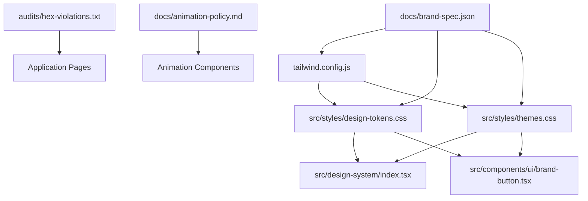

# Design System Alignment Plan

**Date**: 2024-09-09  
**Version**: 1.0  
**Purpose**: Normalize button variants, resolve hex color violations, and align design tokens with brand specifications

## Overview

This plan provides line-specific changes to align the design system components with the Aptly Brand Guidelines 2024. It addresses button normalization, hex color violations, animation policy compliance, and font usage standardization.

## Dependencies Map



## 1. Button System Normalization

### Target: Align Primary/Secondary Variants with Brand Spec

#### src/design-system/index.tsx

**Lines 91-95** - Update button variants to match brand spec:
```diff
  const variantClasses = {
-   primary: "bg-teal text-white hover:bg-opacity-90 focus:ring-teal border-0",
+   primary: "bg-navy text-white hover:bg-opacity-90 focus:ring-navy border-0",
-   secondary: "bg-transparent text-white hover:bg-white/10 focus:ring-white border border-white/30",
+   secondary: "bg-teal text-white hover:bg-opacity-90 focus:ring-teal border-0",
    outline: "bg-transparent text-white hover:bg-white/10 focus:ring-teal border border-teal/50"
  };
```

#### src/components/ui/brand-button.tsx

**Lines 35-36** - Update primary/secondary variants:
```diff
  const variants = {
-   primary: "bg-navy text-white hover:bg-light-navy focus:ring-navy",
+   primary: "bg-navy text-white hover:bg-light-navy focus:ring-navy", // CORRECT - keep as-is
-   secondary: "bg-teal text-white hover:bg-muted-teal focus:ring-teal",
+   secondary: "bg-teal text-white hover:bg-muted-teal focus:ring-teal", // CORRECT - keep as-is
```
*Note: brand-button.tsx is already correct per brand spec*

**Lines 106-107** - Update IconButton variants to match:
```diff
  const variants = {
-   primary: "bg-navy text-white hover:bg-light-navy focus:ring-navy",
+   primary: "bg-navy text-white hover:bg-light-navy focus:ring-navy", // CORRECT - keep as-is
-   secondary: "bg-teal text-white hover:bg-muted-teal focus:ring-teal",
+   secondary: "bg-teal text-white hover:bg-muted-teal focus:ring-teal", // CORRECT - keep as-is
```

#### src/styles/design-tokens.css

**Lines 195-216** - Update button utility classes:
```diff
  .btn-primary {
    height: var(--button-height);
    min-width: var(--button-height);
    padding: 0 var(--space-4);
    border-radius: var(--radius-xl);
-   background: var(--color-teal);
+   background: var(--color-navy);
    color: var(--color-white);
    font-weight: var(--font-weight-medium);
    transition: all var(--transition-base);
  }

  .btn-secondary {
    height: var(--button-height);
    min-width: var(--button-height);
    padding: 0 var(--space-4);
    border-radius: var(--radius-xl);
-   background: transparent;
+   background: var(--color-teal);
    color: var(--color-white);
-   border: 2px solid var(--color-teal);
+   border: none;
    font-weight: var(--font-weight-medium);
    transition: all var(--transition-base);
  }
```

## 2. Hex Color Violations Resolution

### High Priority: Core Application Files

#### src/app/globals.css

**Lines 378-379** - Fix incorrect brand color tokens:
```diff
- --color-navy: #000033;
+ --color-navy: #0A004A;
- --color-teal: #00A0A0;
+ --color-teal: #21A8B0;
```

#### src/styles/themes.css

**Lines 4-8** - Remove non-brand hover colors:
```diff
- --color-primary-hover: #0B0055;
+ --color-primary-hover: #3B336E; /* Use light-navy per brand spec */
- --color-secondary-hover: #25B9C2;
+ --color-secondary-hover: #69BCC1; /* Use muted-teal per brand spec */
- --color-accent-muted: #FFE534;
+ --color-accent-muted: #FFDE00; /* Use exact yellow */
```

**Lines 11-22** - Fix surface and text colors:
```diff
- --color-surface: #F8F9FA;
+ --color-surface: #FFFFFF; /* Use brand white */
- --color-text-secondary: #666666;
+ --color-text-secondary: #CCCCCC; /* Use brand grey */
- --color-text-muted: #999999;
+ --color-text-muted: #E6E6E6; /* Use light-grey */
- --color-border-muted: #F0F0F0;
+ --color-border-muted: #E6E6E6; /* Use light-grey */
```

**Lines 40-58** - Fix dark mode colors:
```diff
- --color-primary-hover: #25B9C2;
+ --color-primary-hover: #69BCC1; /* Use muted-teal */
- --color-secondary-hover: #7BCCD1;
+ --color-secondary-hover: #69BCC1; /* Standardize to muted-teal */
- --color-surface: #151052;
+ --color-surface: #3B336E; /* Use light-navy */
- --color-surface-elevated: #1A155C;
+ --color-surface-elevated: #3B336E; /* Use light-navy */
- --color-card: #1A155C;
+ --color-card: #3B336E; /* Use light-navy */
- --color-card-hover: #221D68;
+ --color-card-hover: #3B336E; /* Use light-navy */
- --color-border-muted: #2A2260;
+ --color-border-muted: #3B336E; /* Use light-navy */
```

#### src/app/privacy/page.tsx

**Line 18** - Fix incorrect navy hex:
```diff
- <div className="min-h-screen bg-[#0A0C2A] text-gray-100">
+ <div className="min-h-screen bg-navy text-gray-100">
```

**Lines 125, 163** - Replace non-brand colors with tokens:
```diff
- className="text-[#7AB8BD] hover:text-[#6BA3A8] transition-colors"
+ className="text-muted-teal hover:text-teal transition-colors"
```

#### src/app/terms/page.tsx

**Lines 163** - Replace non-brand colors:
```diff
- className="text-[#7AB8BD] hover:text-[#6BA3A8] transition-colors"
+ className="text-muted-teal hover:text-teal transition-colors"
```

#### src/app/loading.tsx

**Lines 3, 9, 10, 15** - Fix all color references:
```diff
- <div className="min-h-screen flex items-center justify-center bg-[#0A0C2A]">
+ <div className="min-h-screen flex items-center justify-center bg-navy">
- <div className="w-12 h-12 rounded-full border-4 border-[#0A0C2A] animate-pulse"></div>
+ <div className="w-12 h-12 rounded-full border-4 border-navy animate-pulse"></div>
- <div className="absolute inset-0 w-12 h-12 rounded-full border-4 border-t-transparent border-[#0A0C2A] animate-spin"></div>
+ <div className="absolute inset-0 w-12 h-12 rounded-full border-4 border-t-transparent border-navy animate-spin"></div>
- <div className="w-12 h-12 rounded-full bg-[#7AB8BD] animate-pulse"></div>
+ <div className="w-12 h-12 rounded-full bg-muted-teal animate-pulse"></div>
```

### Medium Priority: Component Files

#### src/components/ui/gradient-mesh.tsx

**Line 18** - Fix incorrect navy color:
```diff
- <div className="absolute inset-0 bg-gradient-to-br from-[#0A0C2A] via-[#1e3a8a]/20 to-[#0A0C2A]" />
+ <div className="absolute inset-0 bg-gradient-to-br from-navy via-light-navy/20 to-navy" />
```

**Lines 57-63** - Replace all non-brand colors:
```diff
- Multiple non-brand colors (#3b82f6, #a855f7, etc.)
+ Replace with brand token equivalents or remove component if off-brand
```

#### src/components/ui/bento-grid.tsx

**Lines 180-192** - Fix gradient colors:
```diff
- from-[#7AB8BD] to-[#F1D632]
+ from-muted-teal to-yellow
```

## 3. Decorative Animation Compliance

### Remove Prohibited Animation Components

Per `docs/animation-policy.md`, these components violate brand guidelines:

#### Files to Remove/Redesign:

1. **src/components/ui/sparkles.tsx** - Violates high-contrast sparkles policy
2. **src/components/ui/shooting-stars.tsx** - Violates starfield pattern policy  
3. **src/components/ui/aurora-background.tsx** - Complex background motion, non-brand colors
4. **src/components/ui/glowing-effect.tsx** - Likely violates brightness/saturation rules

#### Recolor Permitted Animations:

**src/components/ui/gradient-mesh.tsx** - Lines 57-118:
- Replace all non-brand hex colors with brand tokens
- Ensure opacity ≤ 0.3 for overlays
- Use only: navy, teal, light-navy, muted-teal, light-teal

**tailwind.config.js** - Lines 51-54: Keep compliant animations:
- `float: 6s` ✅ (within 8s limit)
- `pulse-slow: 3s` ✅ (within policy range)
- `shimmer`, `ripple` ✅ (short, purposeful)

## 4. Font Family Standardization

### Remove Inline Font Declarations

Replace all inline `style={{ fontFamily: 'DM Sans, sans-serif' }}` with CSS classes:

#### src/app/faq/page.tsx
**Lines 64, 76, 99, 124, 145, 148, 180, 183, 201, 204, 221, 224, 241, 244, 262, 265** - Remove inline styles:
```diff
- style={{ fontFamily: 'DM Sans, sans-serif' }}
+ // Remove - rely on global font-sans class
```

#### src/app/careers/page.tsx
**Lines 65, 77, 114, 117, 133, 136, 141, 146, 150, 174, 177, 194, 212, 215, 218, 221, 248, 251** - Remove inline styles:
```diff
- style={{ fontFamily: 'DM Sans, sans-serif' }}
+ // Remove - rely on global font-sans class
```

#### src/components/TestimonialCard.tsx
**Lines 22, 27, 30, 39, 44, 50, 55, 58** - Remove inline styles:
```diff
- style={{ fontFamily: 'DM Sans, sans-serif' }}
+ // Remove - rely on global font-sans class
```

#### Ensure Global Font Is Active

**src/app/globals.css** - Line 93 confirms DM Sans is properly configured:
```css
font-family: 'DM Sans', system-ui, sans-serif; ✅
```

## 5. Implementation Priority Matrix

### Phase 1: Critical Fixes (Complete First)
1. **Button variant normalization** (design-system/index.tsx lines 91-95)
2. **Core color token fixes** (globals.css lines 378-379)
3. **Theme color standardization** (themes.css lines 4-58)

### Phase 2: Application Fixes
1. **Page-level hex violations** (privacy, terms, loading pages)
2. **Component hex violations** (gradient-mesh, bento-grid)

### Phase 3: Font Standardization
1. **Remove inline font declarations** (all .tsx files with inline styles)

### Phase 4: Animation Compliance
1. **Remove prohibited components** (sparkles, shooting-stars, aurora, glowing-effect)
2. **Recolor permitted animations** (gradient-mesh component)

## 6. Validation Checklist

After implementing changes, verify:

- [ ] Primary buttons use Navy background (`#0A004A`)
- [ ] Secondary buttons use Teal background (`#21A8B0`)
- [ ] All CSS custom properties use exact brand hex values
- [ ] No inline `fontFamily` declarations remain
- [ ] Prohibited animation components are removed
- [ ] All gradient colors use brand tokens only
- [ ] WCAG AA compliance maintained for all color changes

## 7. Risk Assessment

**Low Risk Changes:**
- Button variant updates (isolated to design system)
- Font family removals (global font already configured)

**Medium Risk Changes:**
- Color token updates (may affect visual consistency temporarily)

**High Risk Changes:**
- Animation component removal (may break layouts dependent on these components)

## 8. Testing Requirements

1. **Visual regression testing** on all pages after color changes
2. **Button functionality testing** across all variants
3. **Accessibility testing** for color contrast compliance
4. **Animation performance testing** after component removal

---

**Next Steps**: Review and approve this plan before implementation. Each phase should be completed and tested before proceeding to the next phase.