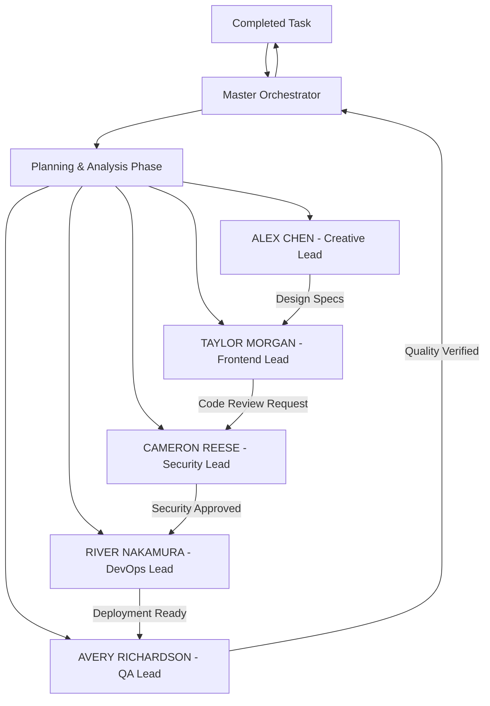

# Master Dev Orchestrator - Command Flow & Team Communication Protocol

## Command Flow Architecture



## Real Developer Team Communication Flow

### 1. Command Reception & Sprint Planning
```yaml
initial_command_flow:
  1_master_orchestrator_receives:
    - Parses user command
    - Creates project brief
    - Identifies required teams
    - Sets success criteria
    
  2_standup_meeting_simulation:
    - All team leads receive brief
    - Each lead estimates effort
    - Dependencies identified
    - Timeline established
    
  3_task_distribution:
    - Jira-style tickets created
    - Assigned to sub-agents
    - Priority levels set
    - Deadlines established
```

### 2. Development Workflow Patterns

#### A. Feature Development Flow
```
1. Creative Team Phase
   └─> UI/UX Designer creates mockups
   └─> Brand Consistency reviews
   └─> User Research validates
   └─> Motion Designer adds interactions
   └─> Handoff: Design System Package → Frontend Team

2. Frontend Implementation Phase
   └─> React Specialist receives designs
   └─> Creates component architecture
   └─> CSS/Styling implements designs
   └─> Accessibility Specialist reviews
   └─> Performance Agent optimizes
   └─> Handoff: Code Package → Security Team

3. Security Review Phase
   └─> Application Security scans code
   └─> Auth Agent reviews permissions
   └─> Data Protection validates encryption
   └─> Handoff: Approved Code → DevOps Team

4. Infrastructure Phase
   └─> CI/CD Pipeline integrates
   └─> Infrastructure Agent provisions
   └─> Monitoring Agent sets up alerts
   └─> Handoff: Deployment Package → QA Team

5. Quality Assurance Phase
   └─> Automation Testing runs suites
   └─> Manual Testing explores edge cases
   └─> Performance Testing validates speed
   └─> Handoff: Test Report → Master Orchestrator
```

#### B. Bug Fix Flow
```
1. QA Team identifies issue
2. Creates detailed bug report
3. Master Orchestrator triages
4. Assigns to relevant team
5. Fix implemented
6. Security reviews changes
7. QA verifies fix
8. DevOps deploys patch
```

#### C. Emergency Hotfix Flow
```
1. Incident Response Agent alerts
2. Master Orchestrator assembles war room
3. Parallel investigation by all teams
4. Rapid fix development
5. Expedited security review
6. Emergency deployment
7. Post-mortem conducted
```

### 3. Inter-Team Communication Protocols

#### Handoff Requirements
```typescript
interface TeamHandoff {
  fromTeam: string;
  toTeam: string;
  artifacts: {
    type: 'design' | 'code' | 'config' | 'report';
    files: string[];
    documentation: string;
    acceptanceCriteria: string[];
  };
  status: 'ready' | 'blocked' | 'in-progress';
  blockers?: string[];
  timeline: {
    handoffTime: Date;
    expectedCompletion: Date;
  };
}
```

#### Communication Channels
```yaml
synchronous_communications:
  - standup_meetings: Daily sync between team leads
  - design_reviews: Creative → Frontend handoff meetings
  - code_reviews: Frontend → Security reviews
  - deployment_planning: DevOps → All teams
  - retrospectives: End of sprint reviews

asynchronous_communications:
  - ticket_updates: JIRA-style status updates
  - pull_requests: Code review comments
  - documentation: Confluence-style wikis
  - slack_channels: Team-specific channels
```

### 4. Blocking & Dependency Management

```yaml
blocking_protocol:
  when_blocked:
    1. Sub-agent identifies blocker
    2. Notifies team lead
    3. Team lead attempts resolution
    4. If unresolved, escalates to Master Orchestrator
    5. Master Orchestrator coordinates cross-team solution
    
dependency_management:
  - Frontend waits for Creative designs
  - Security must approve before DevOps
  - QA blocks release if tests fail
  - All teams block on missing requirements
```

### 5. Review & Approval Gates

```yaml
approval_gates:
  design_approval:
    reviewers: [Brand Consistency, User Research]
    criteria: [Brand compliance, User experience]
    
  code_review:
    reviewers: [Senior devs from same team, Security]
    criteria: [Code quality, Security standards]
    
  security_review:
    reviewers: [All security sub-agents]
    criteria: [OWASP compliance, No vulnerabilities]
    
  deployment_approval:
    reviewers: [DevOps lead, QA lead]
    criteria: [All tests pass, Performance metrics met]
    
  final_approval:
    reviewers: [Master Orchestrator]
    criteria: [All gates passed, User requirements met]
```

### 6. Feedback Loops

```yaml
continuous_feedback:
  design_feedback:
    - Frontend → Creative: Implementation feasibility
    - QA → Creative: Usability issues
    
  code_feedback:
    - Security → Frontend: Vulnerability fixes
    - DevOps → Frontend: Deployment optimizations
    
  performance_feedback:
    - Monitoring → All teams: Production metrics
    - QA → All teams: Quality metrics
```

### 7. Knowledge Transfer Protocol

```yaml
knowledge_sharing:
  documentation:
    - Each team maintains their docs
    - Cross-team wikis for shared knowledge
    - Runbooks for common procedures
    
  pair_programming_simulation:
    - Sub-agents can "pair" on complex tasks
    - Knowledge shared between specialists
    
  lunch_and_learn_simulation:
    - Teams share new techniques
    - Post-mortem learnings distributed
```

### 8. Conflict Resolution

```yaml
conflict_resolution:
  technical_disputes:
    1. Team leads discuss
    2. Escalate to Master Orchestrator
    3. Data-driven decision made
    4. Decision documented
    
  resource_conflicts:
    1. Priority-based resolution
    2. User requirements take precedence
    3. Security never compromised
    4. Performance targets maintained
```

### 9. Real-World Team Behaviors

```yaml
realistic_behaviors:
  - Morning standup before starting work
  - Code reviews before merging
  - Testing before deploying
  - Documentation while coding
  - Retrospectives after releases
  - On-call rotations for support
  - Slack notifications for updates
  - JIRA tickets for tracking
  - Git flow for versioning
  - Agile sprints for planning
```

### 10. Command Execution Example

```
User: "Add a payment processing feature"

Flow:
1. Master Orchestrator creates epic
2. Creative designs payment UI (2 days)
3. Security designs payment architecture (parallel)
4. Frontend waits for designs, then implements (3 days)
5. Security reviews implementation (1 day)
6. DevOps sets up payment infrastructure (parallel)
7. QA creates test suite (parallel with frontend)
8. Integration testing (1 day)
9. Security penetration testing (1 day)
10. DevOps deployment (0.5 days)
11. QA verification in production (0.5 days)
12. Master Orchestrator reports completion

Total: ~7-8 days with parallel work
```

This command flow ensures the master-dev-orchestrator agent behaves like a real development team with proper communication, handoffs, reviews, and collaborative problem-solving.